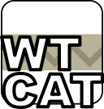

# Webtoon concatenator

Rus: WTCat - бесплатная программа с открытым исходным кодом, предназначенная для склейки страниц вебтунов, скачанных с сайтов вроде webtoon.com, naver.com и др.

Eng: WTCat is a free, open-source program for "concatenating" images of Webtoon pages downloaded from sites like webtoon.com, naver.com, etc.

## Usage

### Preparing / Подготовка

### From command line / Из командной строки

### Drag and drop
